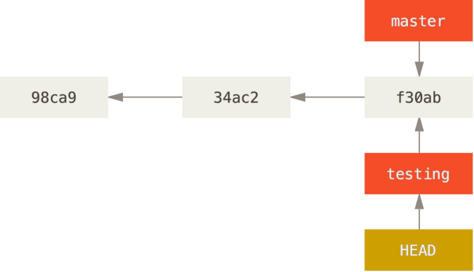
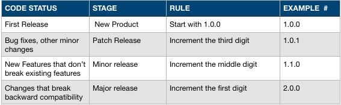
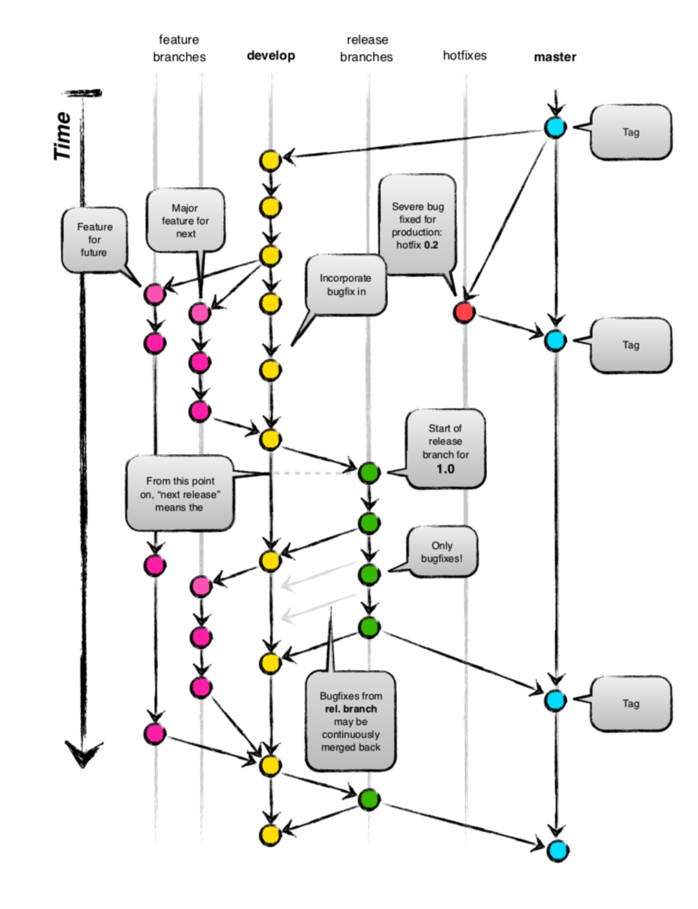

# Git 工作流

## Git 简介

### 分布式版本控制系统

Git 是一个分布式版本控制系统，像 Mercurial、Bazaar 以及 Darcs 等，客户端并不只提取最新版本的文件快照，而是把代码仓库完整地镜像下来。这么一来，任何一处协同工作用的服务器发生故障，事后都可以用任何一个镜像出来的本地仓库恢复。因为每一次的克隆操作，实际上都是一次对代码仓库的完整备份。

## Git 基础

### 直接记录快照，而非差异比较

Git 把数据看作是对小型文件系统的一组快照。每次你提交更新，或在 Git 中保存项目状态时，它主要对当时的全部文件制作一个快照并保存这个快照的索引。为了高效，如果文件没有修改，Git 不再重新存储该文件，而是只保留一个链接指向之前存储的文件。Git 对待数据更像是一个**快照流**。


### 近乎所有操作都是本地执行

在 Git 中的绝大多数操作都只需要访问本地文件和资源，一般不需要来自网络上其它计算机的信息。

### 三种状态

Git 有三种状态，你的文件可能处于其中之一: 已提交(committed)、已修改(modified)和已暂存(staged)。 已提交表示数据已经安全的保存在本地数据库中。已修改表示修改了文件，但还没保存到数据库中。已暂存表示对一个已修改文件的当前版本做了标记，使之包含在下次提交的快照中。

由此引入 Git 项目的三个工作区域的概念:Git 仓库、工作目录以及暂存区域。

- Git 仓库目录是 Git 用来保存项目的元数据和对象数据库的地方。
- 工作目录是对项目的某个版本独立提取出来的内容。
- 暂存区域是一个文件，保存了下次将提交的文件列表信息。

``` bash
LiudeMacBook-Pro:git-demo liu$ git status
On branch master
Changes to be committed:
  (use "git reset HEAD <file>..." to unstage)

	modified:   README.md

Changes not staged for commit:
  (use "git add <file>..." to update what will be committed)
  (use "git checkout -- <file>..." to discard changes in working directory)

	modified:   README.md
```

## Git 分支

有人把 Git 的分支模型称为它的‘必杀技特性’。Git 处理分支的方式难以置信的轻量，创建新分支这一操作几乎能在瞬间完成，并且在不同分支之间的切换操作也是一样便捷。 与许多其它版本控制系统不同，Git 鼓励在工作流 程中频繁地使用分支与合并，哪怕一天之内进行许多次。

### 分支简介

#### Git 是如何保存数据的

> Git 保存的不是文件的变化或者差异，而是一系列不同时刻的文件快照。

在进行提交操作时，Git 会保存一个提交对象(commit object)。该提交对象会包含一个指向暂存内容快照的指针，该提交对象还包含了作者的姓名和邮箱、提交时输入的信息以及指向它的父对象的指针。首次提交产生的提交对象没有父对象，普通提交操作产生的提交对象有一个父对象，而由多个分支合并产生的提交对象有多个父对象。

假设现在有一个工作目录，里面包含了三个将要被暂存和提交的文件。暂存操作会为每一个文件计算校验和（SHA-1 值），然后会把当前版本的文件快照保存到 Git 仓库中（Git 使用 blob 对象来保存它们），最终将校验和加入到暂存区域等待提交：

``` bash
$ git add README test.rb LICENSE
$ git commit -m 'The initial commit of my project'
```
当使用 git commit 进行提交操作时，Git 会先计算每一个子目录（本例中只有项目根目录）的校验和，然后在 Git 仓库中这些校验和保存为树对象。 随后，Git 便会创建一个提交对象，它除了包含上面提到的那些信息外，还包含指向这个树对象（项目根目录）的指针。如此一来，Git 就可以在需要的时候重现此次保存的快照。


现在，Git 仓库中有五个对象：三个 blob 对象（保存着文件快照）、一个树对象（记录着目录结构和 blob 对象索引）以及一个提交对象（包含着指向前述树对象的指针和所有提交信息）。

首次提交对象及其树结构。


做些修改后再次提交，那么这次产生的提交对象会包含一个指向上次提交对象（父对象）的指针。


#### 分支的本质

Git 的分支，其实本质上仅仅是指向提交对象的可变指针。


#### 分支的创建

Git 创建新分支，只是创建了一个可以移动的新的指针。

``` bash
git branch testing
```


#### 切换分支

使用 git checkout 命令切换到新创建的 testing 分支去：

``` bash
$ git checkout testing
```



在 testing 分支上提交一次

``` bash
$ vim test.rb
$ git commit -a -m 'made a change'
```


切换回 master 分支，并提交一次

``` bash
$ git checkout master
$ vim test.rb
$ git commit -a -m 'made other changes'
```


#### 分支的合并

``` bash
$ git checkout -b iss53
Switched to a new branch "iss53"
$ vim index.html
$ git commit -a -m 'added a new footer [issue 53]'
```


``` bash
$ git checkout master
Switched to branch 'master'
$ git checkout -b hotfix
Switched to a new branch 'hotfix'
$ vim index.html
$ git commit -a -m 'fixed the broken email address'
[hotfix 1fb7853] fixed the broken email address
 1 file changed, 2 insertions(+)
```


##### 快进合并

``` bash
$ git checkout master
$ git merge hotfix
Updating f42c576..3a0874c
Fast-forward
 index.html | 2 ++
 1 file changed, 2 insertions(+)
```

在合并的时候，你应该注意到了"快进（fast-forward）"这个词。 由于当前 master 分支所指向的提交是你当前提交（有关 hotfix 的提交）的直接上游，所以 Git 只是简单的将指针向前移动。 换句话说，当你试图合并两个分支时，如果顺着一个分支走下去能够到达另一个分支，那么 Git 在合并两者的时候，只会简单的将指针向前推进（指针右移），因为这种情况下的合并操作没有需要解决的分歧——这就叫做 “快进（fast-forward）”。


#### 非快进合并

``` bash
$ git checkout iss53
Switched to branch "iss53"
$ vim index.html
$ git commit -a -m 'finished the new footer [issue 53]'
[iss53 ad82d7a] finished the new footer [issue 53]
1 file changed, 1 insertion(+)
```


``` bash
$ git checkout master
Switched to branch 'master'
$ git merge iss53
Merge made by the 'recursive' strategy.
index.html |    1 +
1 file changed, 1 insertion(+)
```

这和之前合并 hotfix 分支的时候看起来有一点不一样。 在这种情况下，开发历史从一个更早的地方开始分叉开来。 因为，master 分支所在提交并不是 iss53 分支所在提交的直接祖先。出现这种情况的时候，Git 会使用两个分支的末端所指的快照（C4 和 C5）以及这两个分支的工作祖先（C2），做一个简单的三方合并。


和之前将分支指针向前推进所不同的是，Git 将此次三方合并的结果做了一个新的快照并且自动创建一个新的提交指向它。 这个被称作一次合并提交，它的特别之处在于他有不止一个父提交。


#### rebase

在 Git 中整合来自不同分支的修改主要有两种方法：merge 以及 rebase。


整合分支最容易的方法是 merge 命令，它会把两个分支的最新快照以及二者的最近的共同祖先就行三方合并，合并的结果是生成一个新的快照并提交。


还有一种方法：你可以提取在 C4 中引入的补丁和修改，然后在 C3 的基础上应用一次。 在 Git 中，这种操作就叫做 变基。 我们可以使用 rebase 命令将提交到某一分支上的所有修改都移至另一分支上，就好像“重新播放”一样。

``` bash
$ git checkout experiment
$ git rebase master
First, rewinding head to replay your work on top of it...
Applying: added staged command
```

它的原理是首先找到这两个分支（即当前分支 experiment、变基操作的目标基底分支 master）的最近共同祖先 C2，然后对比当前分支相对于该祖先的历次提交，提取相应的修改并存为临时文件，然后将当前分支指向目标基底 C3, 最后以此将之前另存为临时文件的修改依序应用。


rebase 完成之后，回到 master 分支，进行一次快进合并。

``` bash
$ git checkout master
$ git merge experiment
```


*不要对在你的仓库外有副本的分支执行变基。*

## Git 标签

Git 可以给历史中的某一个提交打上标签，以示重要。 比较有代表性的是人们会使用这个功能来标记发布结点（v1.0.0 等等）。

``` bash
# 列出标签
$ git tag
v0.1.0
v1.3.0

# 显示标签
$ git show v1.4.0

# 创建标签
$ git tag v1.0.0

# 后期打标签
$ git tag -a v1.2.0 9fceb02

# 共享标签
$ git push origin v1.5
$ git push --tags

# 检出标签
$ git checkout -b version2 v2.0.0

# 删除标签
$ git tag -d v0.1.0
$ git push origin :refs/tags/v0.1.0
```

semantic-versioning



## Git 工作流



#### master

主分支，该分支 HEAD 源码始终处于稳定可发布状态。

*不建议（不要）直接在 master 分支上修改代码。*

#### develop

开发分支，当有新的迭代需求来到时，基于 master 分支创建 develop 分支。

``` bash
$ git checkout -b develop master
```

*多个需求并行时，可以存在多个 develop-\* 分支*

#### feature

功能分支，开始一个新的功能开发时，基于 develop 分支创建。

``` bash
$ git checkout -b feat-withdraw develop
```

完成一个功能之后，可以合并进 develop

``` bash
$ git rebase develop
$ git checkout develop
$ git merge feat-withdraw
```

#### release

release 分支是为了新迭代发布准备的。当 develop 分支达到了理想的发布状态，基于 develop 创建 release 分支。在 release 分支我们可以进行一些小的 bug 修复及修改版本号等工作。

``` bash
$ git checkout -b release-1.2.0 develop
$ vim package.json
$ git commit -a -m "bumped version number to 1.2"
```

当一个 release 分支准备好真正发布的时候，将 release 分支合并回 master 上，然后在 master 分支上打一个 tag。

``` bash
$ git rebase master
$ git checkout master
$ git merge release-1.2.0
$ git tag v1.2.0
```

*不要在 release 分支开发新的功能*

#### hotfix

hotfix 用于修复线上 bug，hotfix 基于 master 分支上与线上对应的 tag 创建。

``` bash
$ git checkout -b hotfix-1.2.1 master
```

*修复完所有问题，关闭分支的时侯不要忘了更新版本号。*

修复完 bug 之后，把 hotfix 合并回 master，并打上 tag。

``` bash
$ git rebase master
$ git checkout master
$ git merge hotfix-1.2.1
$ git tag v1.2.1
```